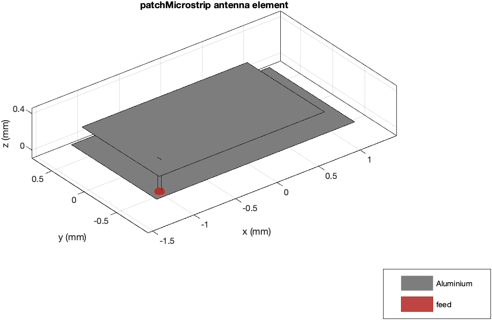
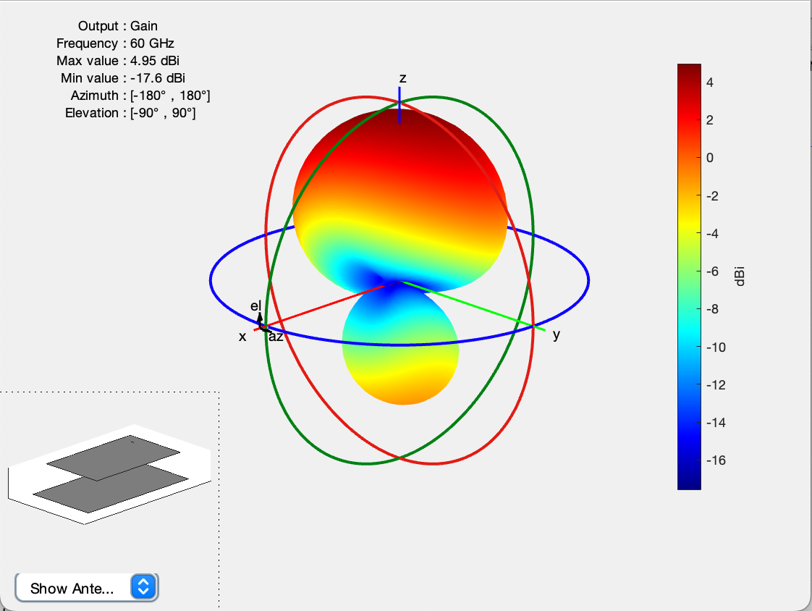
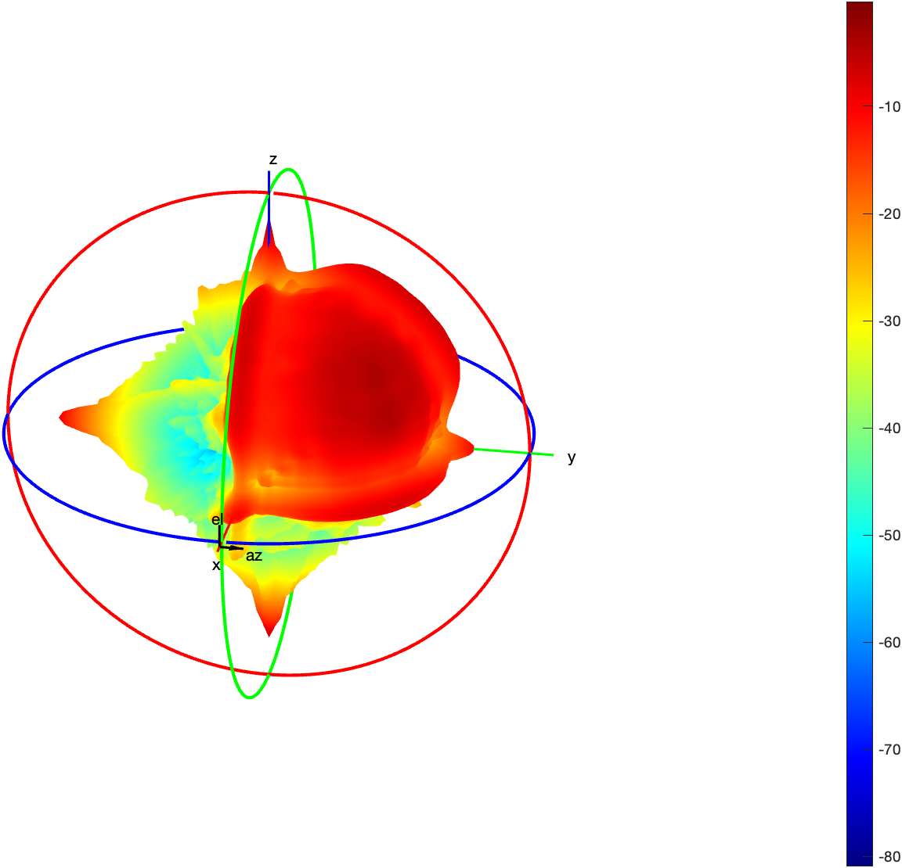
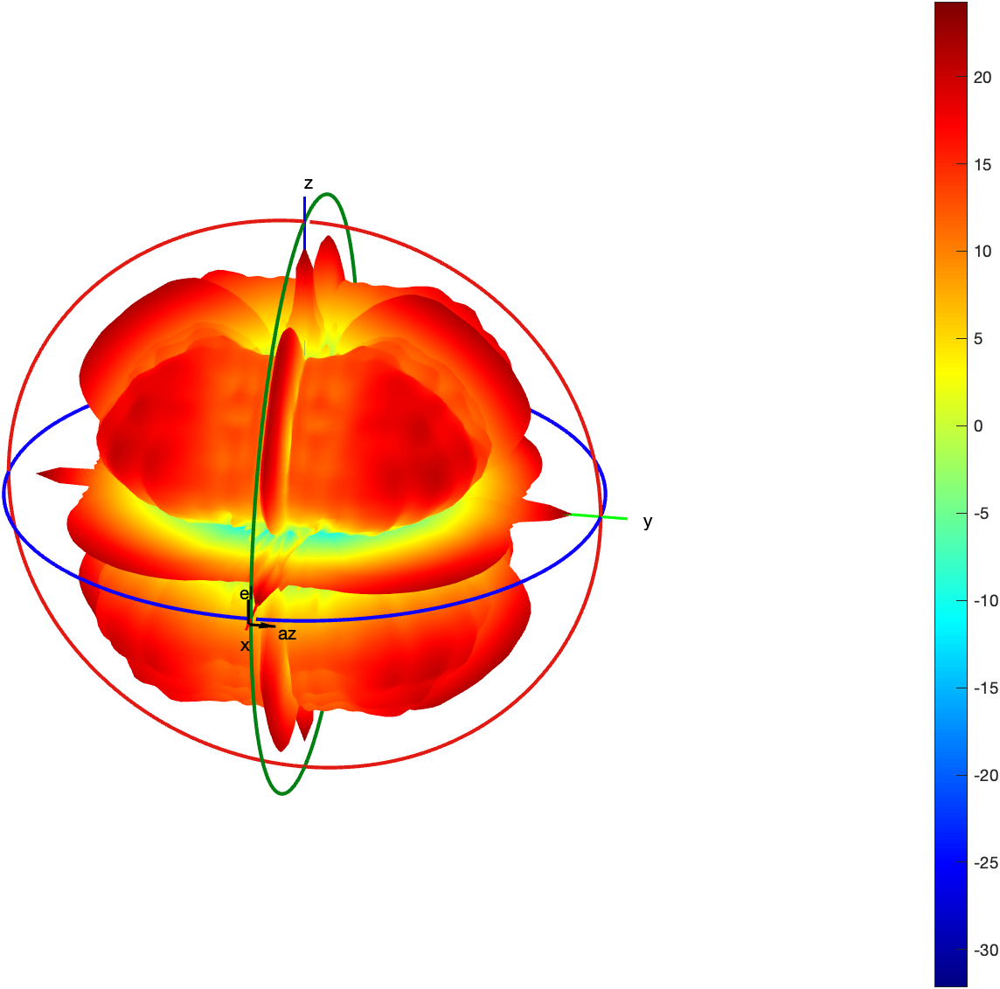
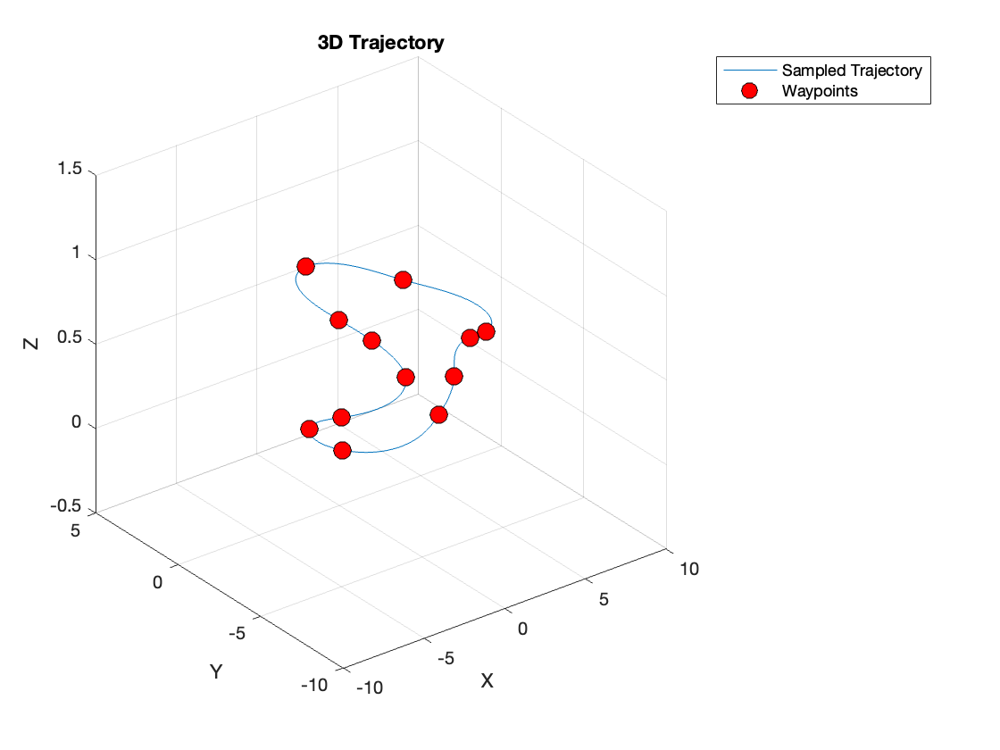
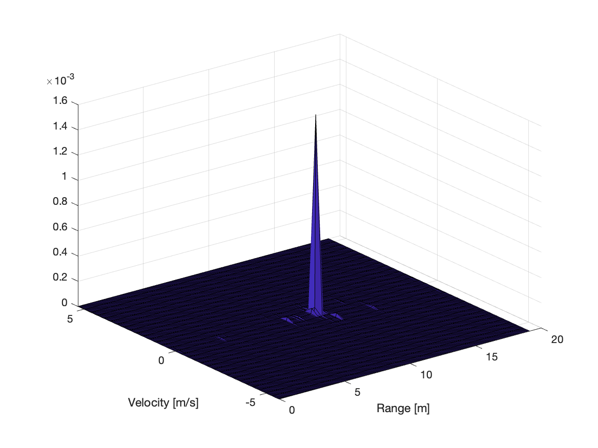
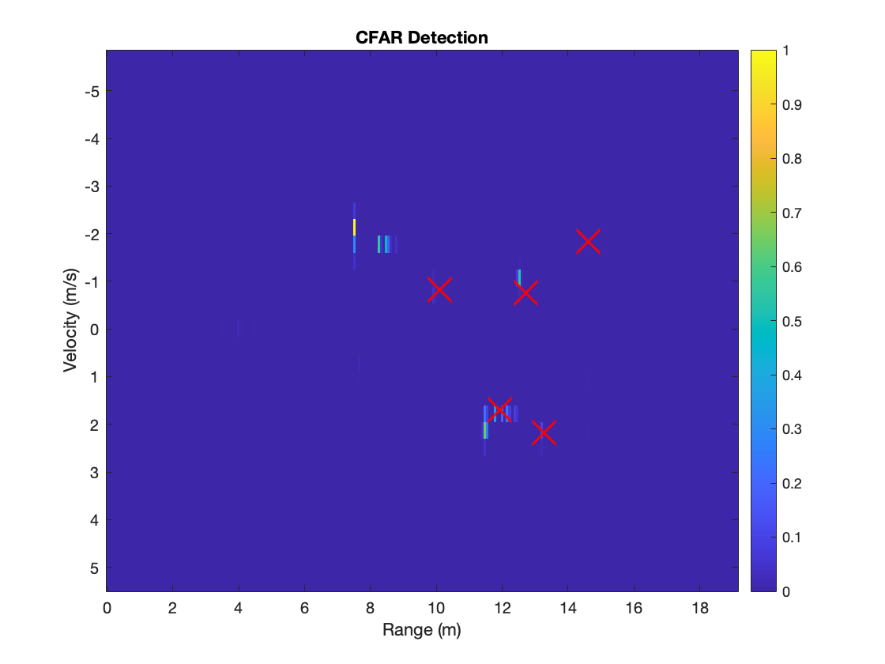
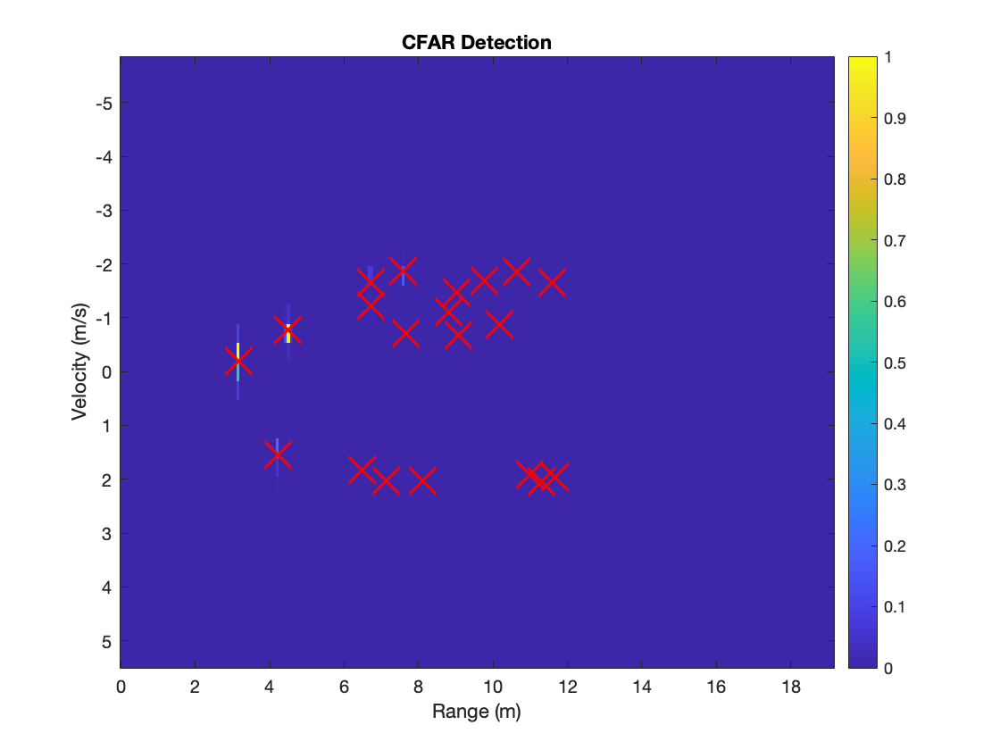
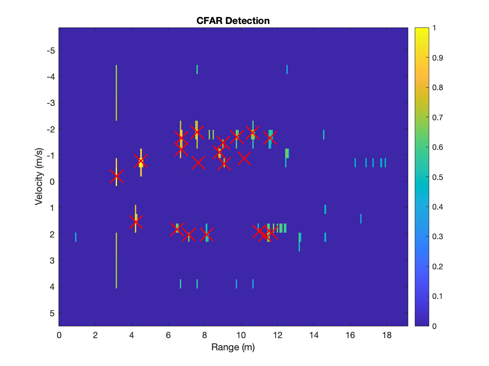

# How to use the code
## Run the raytracing simulation
For the raytracing simulation, run the main.m code.

Following are some parameters which can be modifed to show different cases:
- To change the room model in `main.m` line 35, there are six types, i.e. 
	- "empty" for the empty room model without reflectors,
	- "furniture" for the room model with furniture,
	- "triangular" for the room model with trihedral corner reflector,
	- "octahedral" for the room model with octahedral reflector,
	- "wall_test" for the plausible test with a single wall,
	- "wall_reflector_test" for the plausible test with a single wall and a reflector,

- The type of antenna can be modified in `main.m` line 37, either microstrip or isotropic antenna.

- With trajectory or not modified in `main.m` line 39, if trajectory, the time point can be set in line 44. If specific position, velocity and orientation, set in line 85-87.

- With anisotropic RCS pattern or not can be set in `main.m` line 41.

- CFAR is a "square-root" law detector, which means it detect the range-Doppler matrix only in unit W. But while plotting, the CFAR plots can be shown in various units. To see them, modify in `cfar_detector.m` the type of min and max threshold in line 56-61 and type of range-Doppler amplitude in line 75-77. If dBW or dBm, recommand to use min-max method in line 79 and comment line 78.

- `reflector_los_isotropic.m` and `reflector_los_beampattern.m` are the code to find LOS rays in the case of isotropic and microstrip antenna respectively. To change the position of reflectors, modify the line 11-18 or line 10-18 respectively.
	- For trihedral corner reflector at five corner in the room, recommand to use the position
	```rx_positions = [[-9.3;-0.7;3.5],[-9.3;-9.3;3.5],[9.3;-9.3;3.5],[9.3;9.3;3.5],[0.7;9.3;3.5]];```
	- For the octahedral reflector hung on the ceiling, use the line 15-18.

- To change the RCS pattern of different reflector, either trihedral reflector or octahedral reflector, it can be modified in `reflector_pathloss_beampattern.m` in line 50-51, `rcs_pattern = reflector_pattern.rcs_pattern_dbsm_cleaned;` for octahedral reflector, `rcs_pattern = reflector_pattern.rcs_pattern_dbsm_cleaned_trihed;` for trihedral corner reflector.

- If change the trajectory, modify in `trajectory_generation.m` with the specified positions and their corresponding time points in line 23-37.

## Run the 2D radiation pattern in E- and H-planes
Use the `antennaGain_EH_planes.m` code, and with the change of parameters, the 2D radiation pattern plot will be shown.

## Run the simulation of RCS pattern
- To check the RCS function's availability for our case, use `rcs_steps.m` code, where
	- Line 4-19 demonstrates the tetrahedral objects and its 2D pattern offered by official documentation.
	- Line 21-38 scales the parameters such as the frequency of system and size of reflector as our system, then plot the 2D pattern.
	- Line 40-56 applies our reflector model in the simulation.

- To simulate the 3D RCS pattern, run the `rcs_simulation.m` code, where the type of reflector can be modified in line 8.

# Result
In summary, the raytracing channel simulation works well and meets our goal. Following are some plots and comparisons to show the result of the channel simulation.

## The view of the directional antenna
<div style="display: flex; justify-content: center; gap: 30px;">
  
  
</div>

## The view of the anisotropic radiation pattern
<div style="display: flex; justify-content: center; gap: 100px;">
  
  
</div>

## The trajectory of the robot
<div style="text-align: center;">
  
</div>

## The range-Doppler maps and CFAR plots along the trajectory in GIF format
<div style="display: flex; justify-content: center;">
  
  
</div>

## The influence of the number and arrangement of reflectors
<div style="display: flex; justify-content: center;">
  
  
</div>

## The comparison between the units W and dBW
<div style="display: flex; justify-content: center;">
  
  
</div>